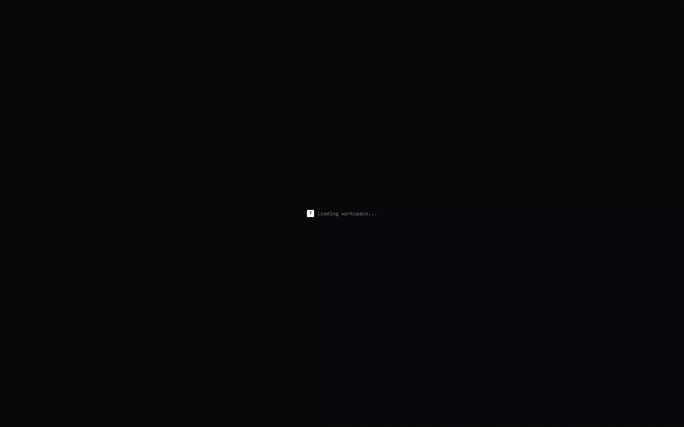
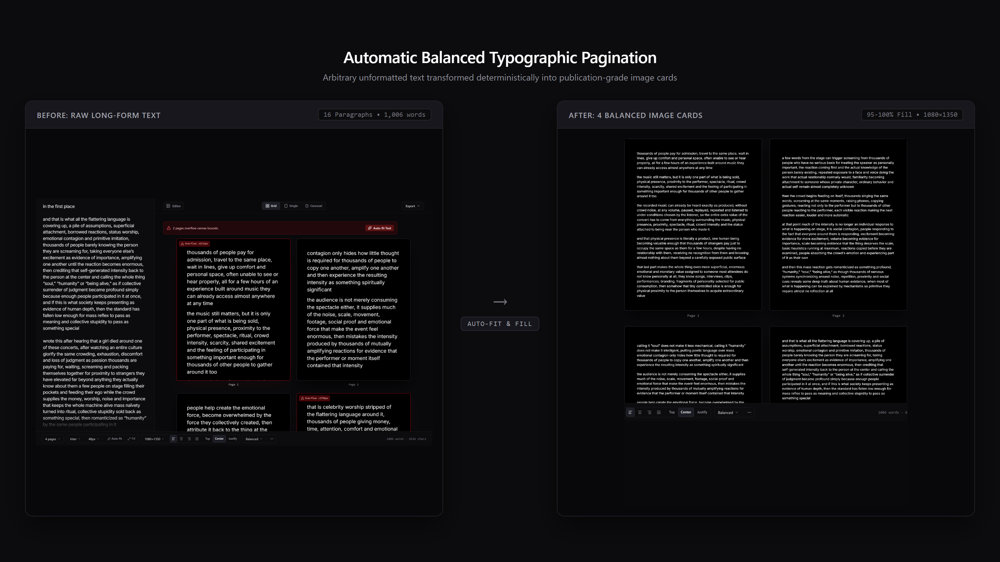
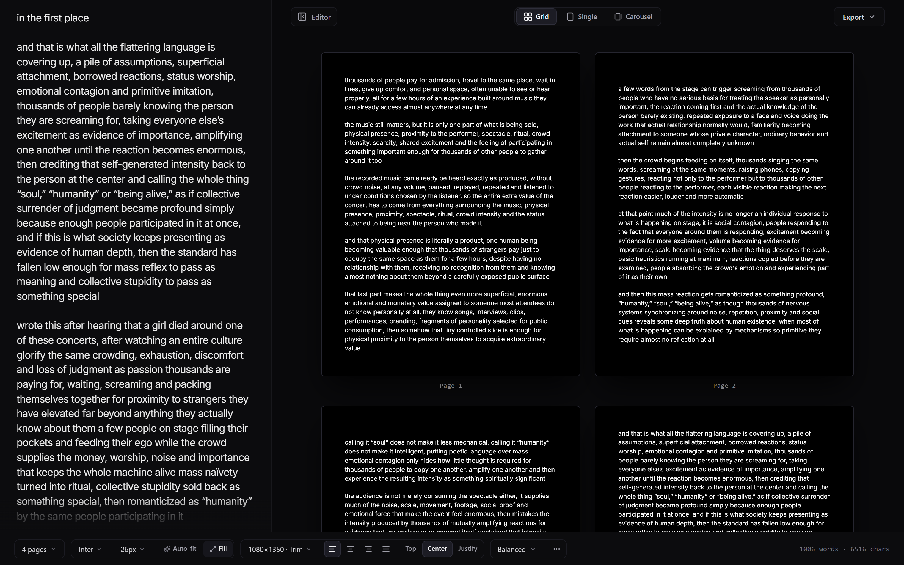
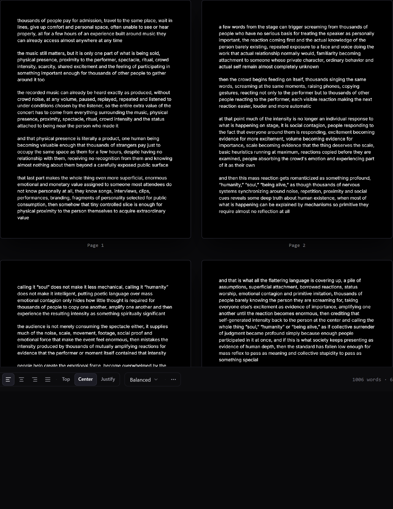
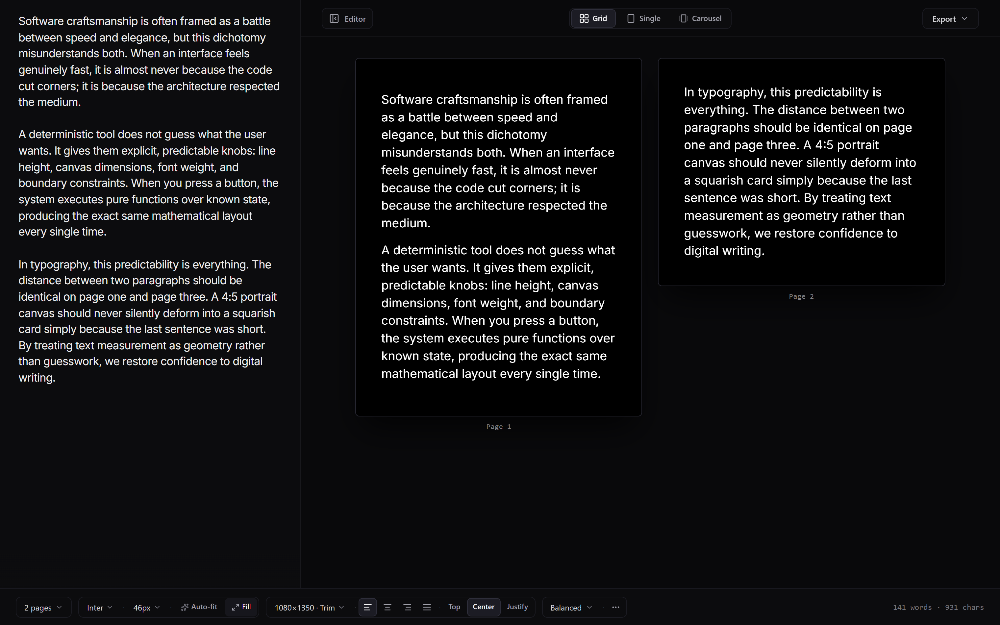
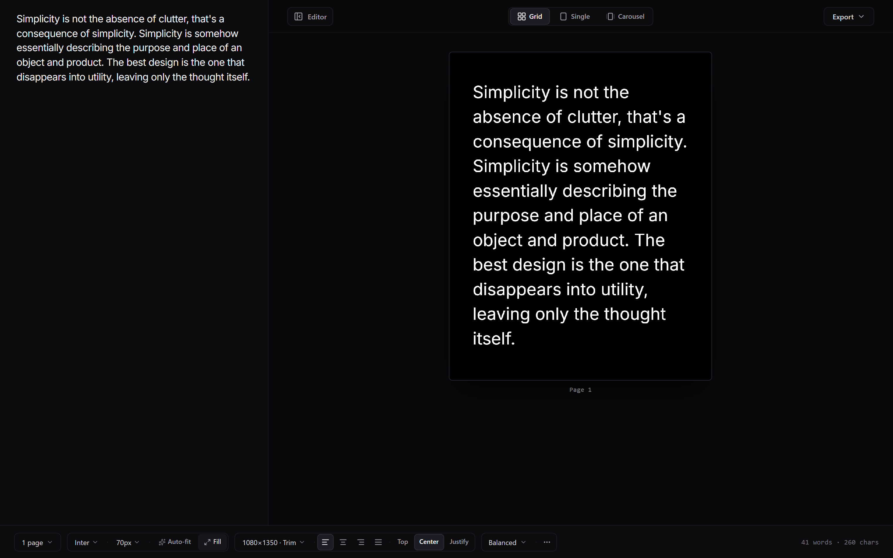
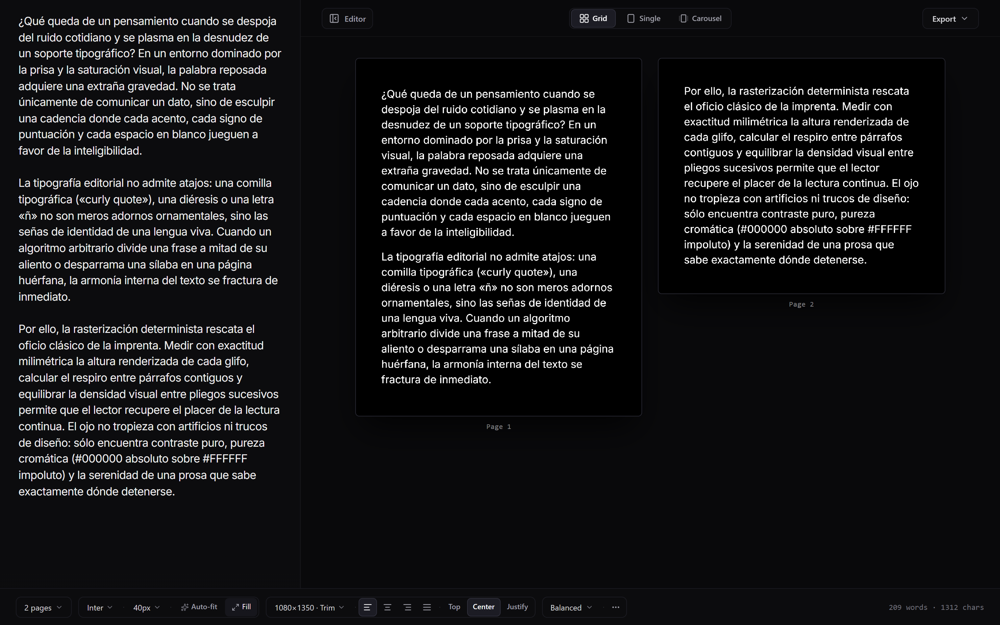
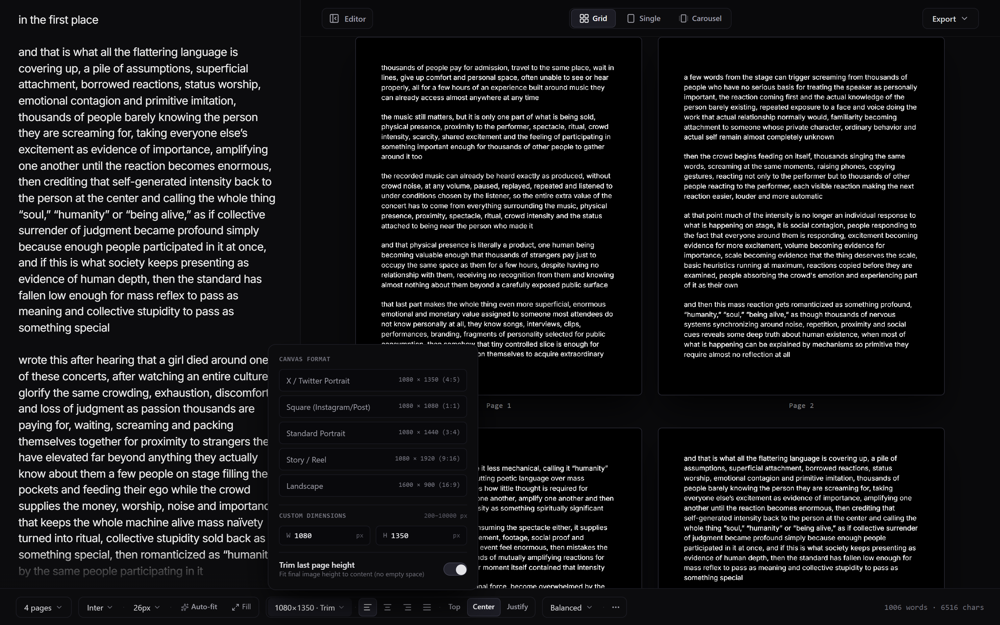
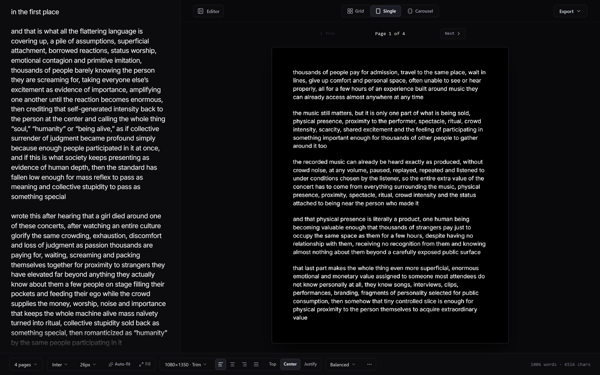
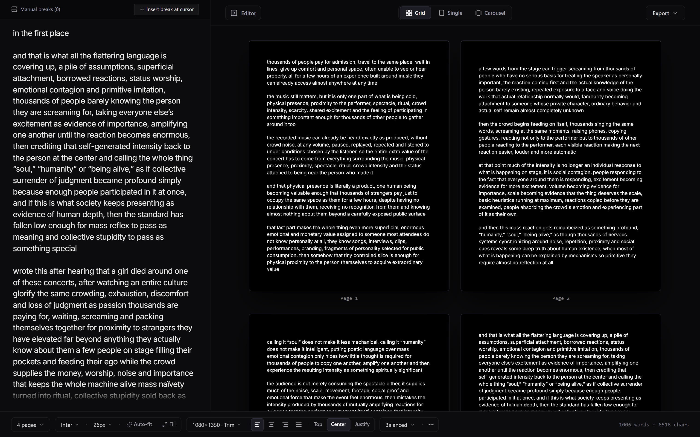

# longform-rasterizer

A deterministic typography engine that transforms arbitrary long-form text into balanced, publication-grade image cards for social feeds (X/Twitter, Threads, Instagram) and editorial publication.



> **Workflow**: Paste text &rarr; select page count &rarr; watch pagination balance automatically &rarr; fine-tune typography &rarr; export crisp PNG/WebP cards or ZIP archive.
>
> Full recording: [`docs/demo.mp4`](docs/demo.mp4) &bull; [`docs/demo.webm`](docs/demo.webm)

---

## The Problem It Solves

Publishing long essays, threads, or articles as images typically suffers from one of three flaws:
1. **Uneven visual balance**: Page 1, 2, and 3 are 98% full, while Page 4 ends abruptly with two orphaned lines.
2. **Broken text fidelity**: Tools silently trim overflowing text, mangle Spanish accents (`á`, `é`, `ñ`, `¿`), or use generative AI to rewrite prose without consent.
3. **Sluggish screenshot hacks**: Generic screenshot scrapers yield blurry text, inconsistent font baselines, and uncontrollable margins.

**longform-rasterizer** treats pagination as a deterministic typesetting problem. It measures text line-by-line using exact Canvas/DOM geometry, preserves paragraph integrity, and balances visual density across your requested number of images.

---

## Before & After



| 1. Long Unformatted Text (Input) | 2. Deterministic Balanced Output (1080&times;1350) |
| :--- | :--- |
| **Input**: 16 paragraphs, 1,006 words pasted raw into the editor | **Output**: Exactly 4 visually balanced cards with 95–100% canvas utilization |
| Words and paragraphs are never rewritten or hallucinated | Paragraph boundaries are prioritized, preventing awkward splits |
| Font size and spacing automatically resolved via binary search | Rendered on pure `#000000` background with sharp `#FFFFFF` typography |

---

## Studio Interface



The interface is built as a distraction-free editorial studio:
- **Left**: Raw text input supporting arbitrary length, Unicode, curly quotes, diacritics, and drag-and-drop file ingestion (`.txt`, `.md`).
- **Right**: Real-time multi-page preview with sub-pixel crispness. Hovering over cards highlights corresponding text in the editor; clicking a card jumps to that page's text.
- **Docked Shelf**: Compact control cluster for Page Count, Font Family, Font Size, Format / Trim, Text Alignment, Vertical Justification, and Margin Presets.

---

## Output Examples

### 4-Page Essay Output

*Balanced multi-page distribution with 95–100% vertical utilization across all cards.*

### 2-Page Essay Output

*Evenly partitioned 2-page essay maintaining clean editorial line lengths.*

### 1-Page Aphorism / Single Post

*Single-thought presentation with centered vertical justification and crisp margins.*

### Spanish Editorial & Diacritics Preservation

*Full fidelity for acute accents (`á`, `é`, `í`, `ó`, `ú`), Spanish `ñ`, inverted questions (`¿`), exclamations (`¡`), and guillemets (`«`, `»`).*

---

## Key Features

### 1. Rendered-Height Pagination Engine
Splits text based on actual geometric rendered height rather than character or word approximations. Split points are evaluated in strict priority:
1. Paragraph boundaries (prevents fragmenting thoughts)
2. Sentence boundaries
3. Soft line wraps
4. Word breaks (strictly prohibits breaking inside words)

### 2. Canvas Fill Optimizer (`Fill` / `Auto-fit`)
A binary-search typography solver automatically determines the maximum readable global font size that fits your document across exactly $N$ pages. All pages share identical typography settings—individual pages are never artificially shrunk or warped.

### 3. Trim Last Page Height
When enabled, the final card's canvas height dynamically trims to wrap its content tightly rather than leaving trailing blank space:



### 4. Single-Page Focus & Carousel Views
Switch between a 2-column studio grid, a focused single-card inspection view with keyboard arrow navigation, and a snap-scrolling carousel:



### 5. Manual Page Breaks
For custom editorial control, switch from `Balanced` to `Manual` distribution mode to insert explicit page breaks at your cursor position:



### 6. Local Custom Font Upload
Upload local `.ttf`, `.otf`, `.woff`, or `.woff2` fonts directly in the browser via the native `FontFace` API. No font files or essays are ever transmitted to an external server.

---

## Sample Texts for Immediate Testing

Realistic sample texts of varying lengths are located in [`docs/samples/`](docs/samples/):

| Sample File | Content Type | Paragraphs | Words | Recommended Target |
| :--- | :--- | :--- | :--- | :--- |
| [`concert-essay-16paras.txt`](docs/samples/concert-essay-16paras.txt) | Long-form social commentary | 16 | 1,006 | 4 pages (1080&times;1350) |
| [`spanish-literary-essay.txt`](docs/samples/spanish-literary-essay.txt) | Spanish editorial essay | 7 | 485 | 2 pages (1080&times;1350 · Trim) |
| [`medium-craftsmanship-2pages.txt`](docs/samples/medium-craftsmanship-2pages.txt) | Technology & craft reflection | 5 | 365 | 2 pages (1080&times;1350) |
| [`short-aphorism-1page.txt`](docs/samples/short-aphorism-1page.txt) | Typography quote | 1 | 54 | 1 page (1080&times;1080 or 1080&times;1350) |

---

## Architecture & Technology Stack

```
longform-rasterizer/
├── src/
│   ├── app/                    # Next.js App Router (Client-side single-page architecture)
│   ├── components/
│   │   ├── EditorPanel.tsx     # Textarea editor with sync mirror & drag-drop
│   │   ├── PreviewPanel.tsx    # Responsive Grid, Single, and Carousel viewports
│   │   ├── PageCard.tsx        # HTML5 Canvas viewport renderer & zoom
│   │   ├── DockedToolbar.tsx   # Obsidian floating tool shelf
│   │   └── FullscreenModal.tsx # Fullscreen review overlay
│   ├── engine/
│   │   ├── textMeasurement.ts  # DOM-calibrated line and word measurement
│   │   ├── lineWrapper.ts      # Deterministic word-wrap with Unicode support
│   │   ├── pagination.ts       # Dynamic programming multi-page partitioner
│   │   ├── canvasFillOptimizer.ts # Multi-variable font/page optimizer
│   │   ├── canvasRenderer.ts   # High-DPI canvas drawing pipeline
│   │   ├── exportEngine.ts     # Lossless PNG, JPEG, WebP, and ZIP packaging
│   │   └── fontLoader.ts       # Document fonts & FontFace loader
│   └── types/                  # Typed schema for all document & layout states
├── docs/                       # Release screenshots, video walkthrough, and demo assets
│   └── samples/                # Benchmark sample texts
└── scripts/
    ├── prepare_samples.mjs     # Standalone generator for sample text fixtures
    └── generate_demos.mjs      # Playwright + FFmpeg automated demo generator
```

- **Framework**: Next.js 16 (App Router), React 19, TypeScript
- **Styling**: Tailwind CSS (Obsidian Dark palette `#0c0c0e`, `#121216`, `#1b1b22`)
- **Rendering**: Native HTML5 Canvas 2D Context (`devicePixelRatio` scaling)
- **Packaging**: JSZip, FileSaver
- **Deterministic Invariant**: `join(allPageText) === originalText`. No characters are dropped, added, or mutated.

---

## Getting Started

### Prerequisites
- Node.js 18+
- npm 9+

### Installation & Development

```bash
# Clone the repository
git clone https://github.com/miyakejima/longform-rasterizer.git
cd longform-rasterizer

# Install dependencies
npm install

# Start development server
npm run dev
```

Open [http://localhost:3000](http://localhost:3000) in your browser.

### Production Build

```bash
# Build optimized production bundle
npm run build

# Serve production build locally
npm start
```

### Running Test Suites

```bash
# Run all Vitest unit and integration suites
npx vitest run
```

### Regenerating Demo Assets

To programmatically re-record the walkthrough video, generate the GIF, and capture all screenshots from the live application:

```bash
# Prerequisites: Edge or Chromium installed, FFmpeg in PATH
node scripts/generate_demos.mjs
```

---

## License

MIT &copy; [miyakejima](https://github.com/miyakejima)


