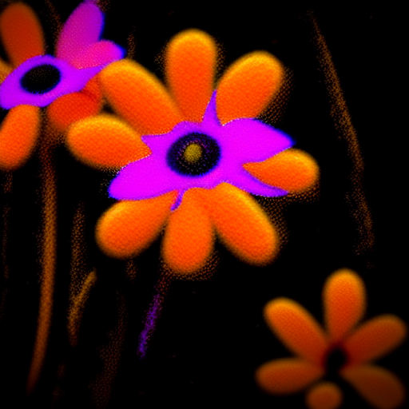
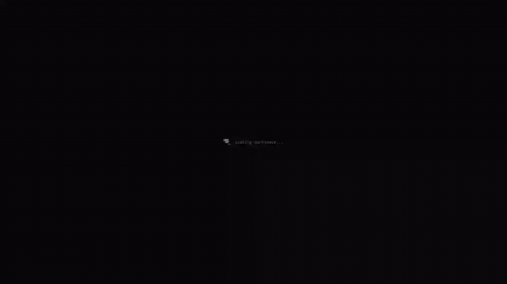
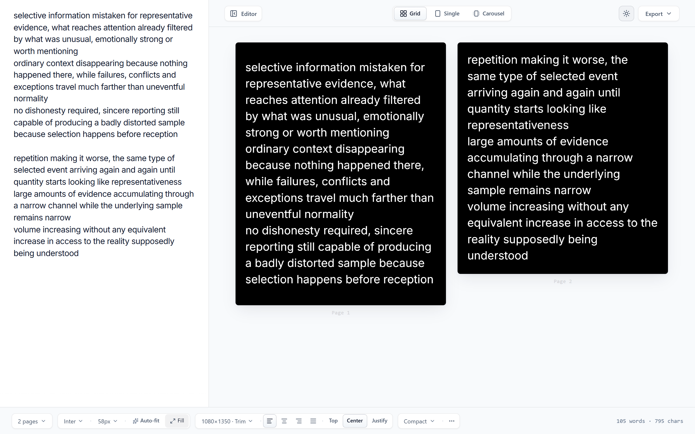
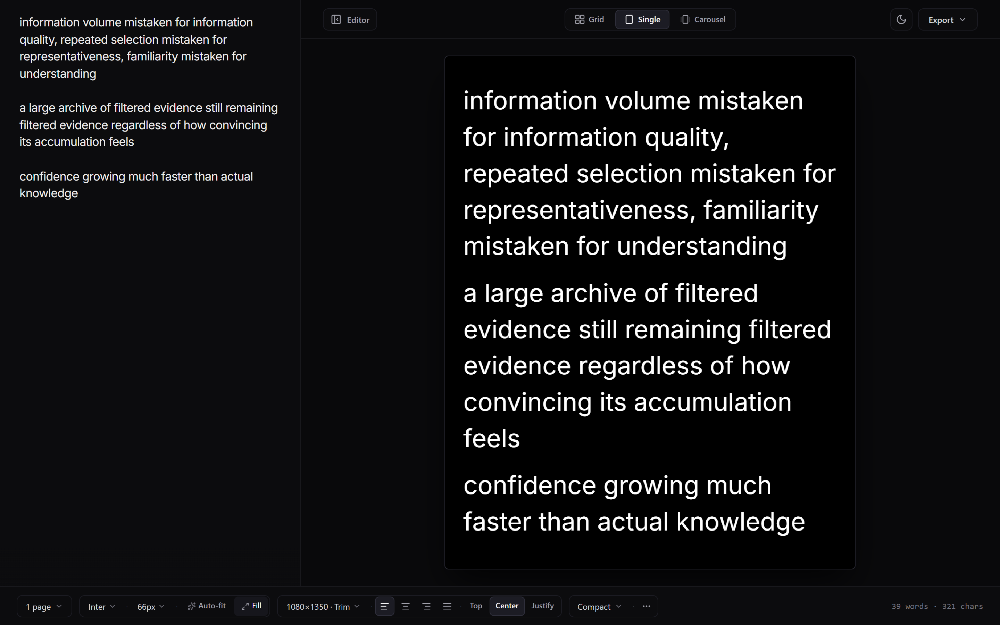

<p align="center">
  <a href="https://miyakejima.github.io/longform-rasterizer/">
    
  </a>
</p>

<h1 align="center">longform-rasterizer</h1>

<p align="center">
  <strong>Dynamic Long-Form Text Typesetting Engine</strong><br>
  Turn essays, quotes, and threads into balanced, high-resolution image cards.
</p>

<p align="center">
  <a href="https://miyakejima.github.io/longform-rasterizer/"><strong>Launch Web App</strong></a> ·
  <a href="#why-this-exists">Why This Exists</a> ·
  <a href="#previews">Previews</a> ·
  <a href="#features">Features</a> ·
  <a href="#canvas-presets">Canvas Presets</a> ·
  <a href="#run-locally-optional">Run Locally</a>
</p>

<p align="center">
  Open and use directly in your browser:<br>
  <a href="https://miyakejima.github.io/longform-rasterizer/"><strong>https://miyakejima.github.io/longform-rasterizer/</strong></a>
</p>

---

<p align="center">
  <a href="https://miyakejima.github.io/longform-rasterizer/">
    
  </a>
</p>

---

## Why this exists

Posting long-form writing on visual social platforms (X, Threads, Instagram, LinkedIn) is broken:

- **Character Limits**: Standard posts truncate text, forcing writers into fragmented multi-post threads or external blog links with poor reach.
- **The "Notes App Screenshot" Trap**: Taking screenshots of text editors or notes apps produces low-resolution imagery with awkward margins, spellcheck squiggles, and unpredictable font scaling.
- **Manual Design Friction**: Laying out text manually across design tools requires constant re-adjusting whenever text is edited.

longform-rasterizer solves this with dynamic layout partitioning directly in your browser. Paste your text, choose your canvas preset, and the engine automatically balances line heights, font sizes, and paragraph breaks across cards with over 95% vertical utilization—ready for instant high-DPI export.

---

## Previews

### Balanced Multi-Card Workstation (Linen Light Theme)



### Single Focus View (AMOLED Dark Theme)



---

## Features

- **Optimal Page Distribution**: Hierarchical dynamic programming splits text at natural paragraph and sentence boundaries without mid-thought breaks.
- **Auto-Fit and Fill Optimization**: Automatically calculates optimal font sizing, line-height, and paragraph spacing for maximum card utilization.
- **Workstation Layout and Focus Modes**: Seamlessly switch between Grid, Single Focus, and Carousel views with zero layout jitter.
- **Lossless Text Preservation**: Layout engine operates purely on geometric distribution—no text modification, rewriting, or synthesis.
- **Orphan and Widow Suppression**: Soft-penalizes and prevents stranded single lines across card transitions.
- **Terminal Card Auto-Trim**: Automatically trims the final card canvas height to match content, preventing trailing empty space.
- **Dual Themes**: Crisp Linen light theme and pure AMOLED dark theme with custom typography palettes.
- **High-DPI Retina Rendering**: Subpixel anti-aliased Canvas 2D rendering with 1x, 2x, and 3x scale options.
- **Batch Export**: Instant export to PNG, WebP, or JPEG, including one-click ZIP download of all generated cards.
- **Client-Side Processing**: Runs 100% in your browser. Your text never leaves your device.

---

## Canvas Presets

| Preset | Dimensions | Aspect Ratio | Target Platform |
|---|---|---|---|
| **X Essay (Default)** | 1080 × 1350 | 4:5 | X (Twitter), Threads, LinkedIn |
| **Story** | 1080 × 1920 | 9:16 | Instagram Stories, TikTok, Shorts |
| **Square** | 1080 × 1080 | 1:1 | Instagram Feed, Profile Banners |
| **Custom** | Custom px | Configurable | Newsletters, blog headers, editorial prints |

---

## Run Locally (Optional)

Prerequisites: Node.js 18+ and npm.

```bash
# Clone the repository
git clone https://github.com/miyakejima/longform-rasterizer.git
cd longform-rasterizer

# Install dependencies
npm install

# Start local development server
npm run dev
```

Open `http://localhost:3000` in your browser.

---

## License

MIT
