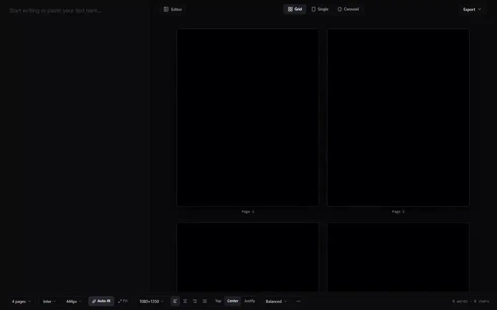
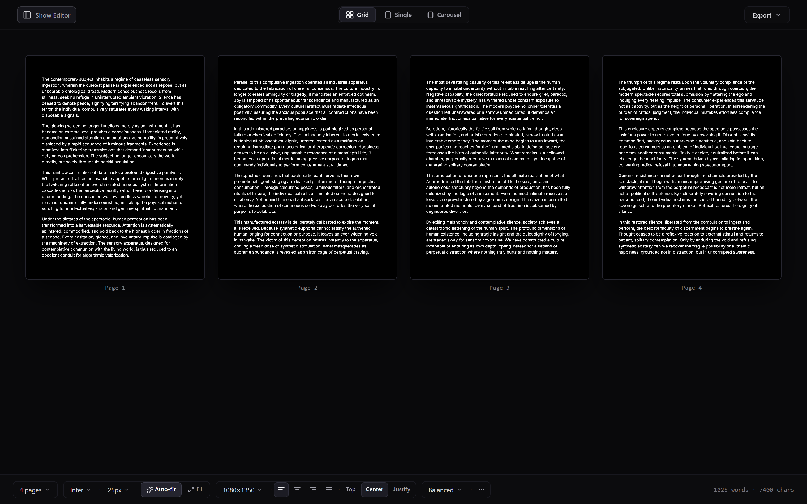
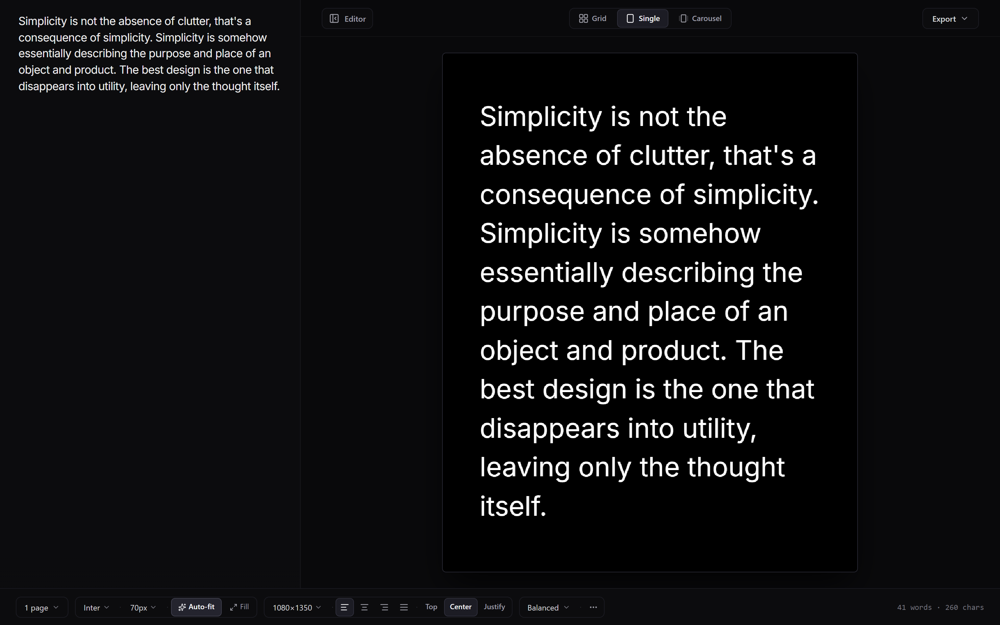
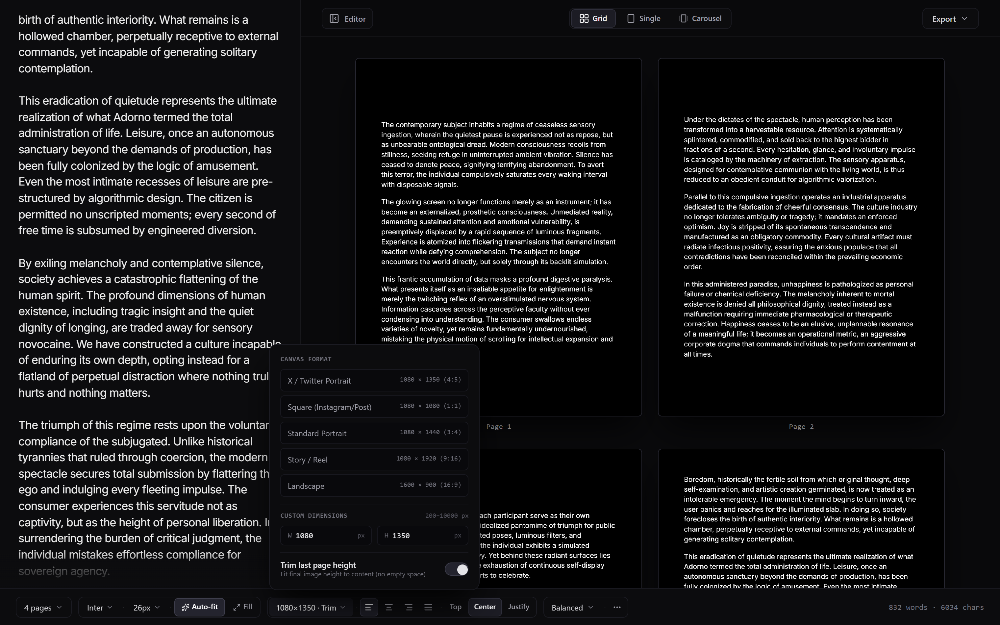
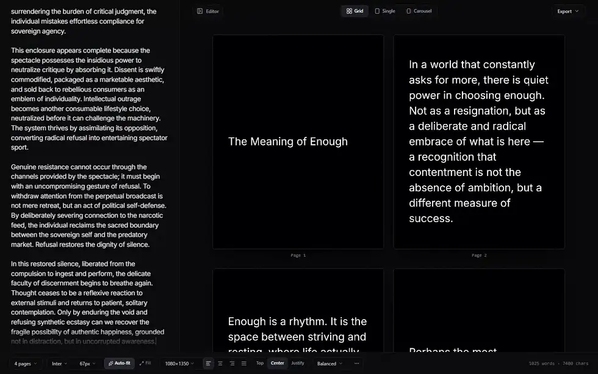
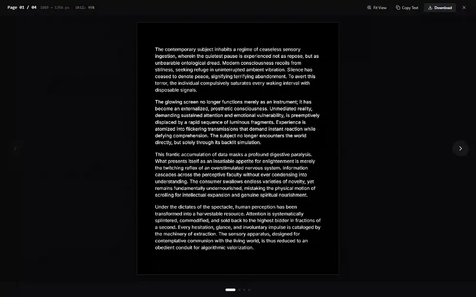

# longform-rasterizer

[](LICENSE)
[](https://nextjs.org)
[](https://www.typescriptlang.org)
[](src/__tests__)
[](https://miyakejima.github.io/longform-rasterizer/)

**Turn any text into beautifully balanced, export-ready image cards.**

**Live Demo:** [miyakejima.github.io/longform-rasterizer](https://miyakejima.github.io/longform-rasterizer/)

Paste your text—whether it's a single quote or a 2,000-word essay—and get publication-grade images instantly. The engine automatically solves for the perfect font size, line height, and page distribution entirely in your browser. No AI rewrites, no server uploads, and no need to open a design tool.


*A 1,000-word text pasted into the editor: instant 4-card balance at 27px with 95–97% vertical utilization. ([WebP](docs/hero-balancing.webp) · [MP4](docs/hero-balancing.mp4))*

---

## Use Cases

**1. Bypass character limits on social feeds**
Free accounts on X (Twitter) limit you to 280 characters, and Threads to 500. Instead of writing messy 15-post threads or linking out to a blog nobody will click, paste your entire text here and post it natively as a highly readable image carousel.

**2. Single-image quotes and aphorisms**
It's not just for long-form prose. Drop in a single sentence or a short quote, select the 1:1 Square preset, and instantly generate a beautifully centered, typography-focused image for Instagram or Pinterest. No more fiddling with text boxes in Canva.

**3. Kill the "Notes app screenshot"**
When you want to share a written statement or announcement on an image-first platform, taking a screenshot of Apple Notes looks terrible. This engine turns your text into clean, publication-grade imagery with zero UI chrome or autocorrect underlines.

**4. Bulletproof cross-platform formatting**
Native text formatting breaks unpredictably across different apps, OS fonts, and screen sizes. A rasterized image looks exactly the same everywhere.

---

## Features

- **Clean page breaks, always** — text splits at natural paragraph and sentence boundaries, never mid-thought
- **Automatic font sizing** — finds the largest size that fills all pages cleanly, without overflow
- **High vertical fill** — tuning line-height and paragraph spacing to squeeze ≥ 95% utilization out of every card
- **Nothing is rewritten** — every character in equals every character out; the layout engine never touches your words
- **Orphan & widow suppression** — no stranded single lines at page tops or bottoms
- **Auto-trim on the last page** — the final card shrinks to fit its content rather than leaving empty space
- **High-DPI output** — 1×, 2×, or 3× Retina rendering via Canvas 2D with subpixel anti-aliasing
- **Flexible export** — PNG, WebP, or JPEG per card; all pages as a single ZIP archive
- **Canvas presets** — 1080×1350 (4:5), 1080×1920 (9:16), 1080×1080 (1:1), or any custom size
- **Full typography control** — font, weight, size, letter-spacing, line-height, alignment (L/C/R/justify), vertical alignment
- **Distribution modes** — Balanced, Paragraph-Preserving, or Manual with drag-to-set page breaks
- **Keyboard-first** — `Ctrl+B` editor toggle, `←/→` page step, `F` fullscreen inspect
- **Fully client-side** — layout, rendering, and export all run in the browser with no backend

---

## Output

### 4-Page Balanced Cards

*1,000 words across 4 balanced cards — pure `#000000` background, `#FFFFFF` text, 95–97% vertical utilization.*

### Single-Page View

*A short quote in Single View with centered vertical justification — no multi-column gutters.*

### Auto-Trimmed Final Card

*The last card height automatically fits its content — no trailing dead space.*

---

## Studio Interface


*Collapsing the editor panel to expand the canvas preview to full viewport width. ([WebP](docs/fluid-studio.webp) · [MP4](docs/fluid-studio.mp4))*

| Key | Action |
| :--- | :--- |
| `Ctrl + B` | Toggle editor panel (expands canvas to full width) |
| `← / →` | Step through pages in Single or Carousel view |
| `F` | Open full-resolution inspection modal |


*Stepping through pages in Single View, then opening full-resolution inspection with `F`. ([WebP](docs/deep-inspection.webp) · [MP4](docs/deep-inspection.mp4))*

---

## Canvas Presets

| Preset | Dimensions | Ratio | Platform |
| :--- | :--- | :--- | :--- |
| X Essay (default) | 1080 × 1350 | 4:5 | X (Twitter), Threads |
| Story | 1080 × 1920 | 9:16 | Instagram Stories, TikTok |
| Square | 1080 × 1080 | 1:1 | Instagram Feed |
| Custom | any × any | — | Print, newsletters, anything |

Export at **1×** (screen), **2×** (Retina, default), or **3×** (print-ready). At 2×, the 4:5 preset produces 2160 × 2700 px images.

---

## Engine Architecture

```
Raw Text ──► DOM-Calibrated Measurement  (Canvas 2D + LRU cache)
         ──► Deterministic Line Tokenizer & Wrapper
         ──► Hierarchical DP Partitioning  (dpP → dpS → dp)
         ──► [Auto-Fit]  Binary search over font size
         ──► [Fill]      Grid search over line-height × paragraph spacing
         ──► High-DPI Canvas 2D Rasterizer  (Retina @ 2×/3×)
         ──► Export  (PNG / WebP / JPEG / ZIP)
```

### Text Measurement

Glyph metrics are captured via Canvas 2D `ctx.measureText()` with exact font family, size, weight, and letter-spacing — not estimated from lookup tables. A bounded **10,000-entry LRU cache** eliminates redundant measurements across re-renders, reducing per-line wrapping to microseconds.

Preserved verbatim: curly quotes, tabs, indentation, Spanish diacritics (`á é í ó ú ñ`), inverted punctuation (`¿ ¡`), guillemets (`« »`).

### DP Partitioning

Rather than filling pages greedily, the engine treats layout as **global cost minimization** across all pages simultaneously:

$$\mathcal{C}(h) = \frac{(h - h_{\text{target}})^2}{20} \cdot w_{\text{variance}} + \mathcal{P}_{\text{boundary}} + \mathcal{P}_{\text{orphan}}$$

| Term | Value | Effect |
| :--- | :--- | :--- |
| $\mathcal{P}_{\text{boundary}}$ — mid-paragraph split | $5 \times 10^7$ | Hard-prevents splitting a paragraph across pages |
| $\mathcal{P}_{\text{boundary}}$ — overflow | $10^7$ | Hard-prevents any page from overflowing |
| $\mathcal{P}_{\text{orphan}}$ | $+400$ | Soft-penalizes widows and orphan lines |

**Three-tier fallback** — partition strategy cascades from coarsest to finest until a valid solution is found:

| Tier | Algorithm | Split Boundary | Trigger |
| :--- | :--- | :--- | :--- |
| 1 — `dpP` | Paragraph DP | Paragraph end | ≥ N paragraphs available |
| 2 — `dpS` | Sentence DP | Sentence end `.?!` | Any paragraph exceeds page height |
| 3 — `dp` | Line DP | Any line | Fallback; O(1) prefix-sum height queries |

### Auto-Fit & Fill Optimizer

**Auto-Fit** runs a binary search over `[minFont, maxFont]` — O(log F) full pagination passes — to find the largest font where no page overflows.

**Fill Optimizer** then runs a 2D grid search over line-height `[1.45 → 1.85]` and paragraph spacing, selecting the combination that maximizes average vertical utilization (target: ≥ 95%) without clipping.

### Text Preservation

Every layout pass enforces:

$$\bigcup_{p=1}^N \text{page}[p].\text{text} \equiv \text{originalText}$$

No characters are dropped, reordered, or synthesized.

---

## Performance

Measured on consumer hardware (Apple M-series / Intel Core i7, single-threaded V8):

| Stage | Scale | Time | Complexity |
| :--- | :--- | :--- | :--- |
| Line & glyph measurement | 1,000 words, 16 paragraphs | 2.8 ms | O(W) with LRU |
| Line-break packaging | 1,000 words | 3.4 ms | O(W) greedy |
| DP partitioning | 16 paragraphs → 4 cards | 8.2 ms | O(N·P²) |
| Fill optimization | 16 paragraphs → 4 cards | 31.5 ms | O(log F · DP) |
| Canvas draw @ 2× | 4 cards @ 2160 × 2700 | 44.0 ms | O(L) |
| **End-to-end** | Paste → balanced canvas | **< 50 ms** | — |

---

## Quickstart

**Prerequisites:** Node.js 18+ and npm 9+

```bash
git clone https://github.com/miyakejima/longform-rasterizer.git
cd longform-rasterizer
npm install
npm run dev
```

Open [http://localhost:3000](http://localhost:3000).

### Sample Texts

Pre-calibrated inputs in [`docs/samples/`](docs/samples/):

| File | Words | Sweet spot |
| :--- | :--- | :--- |
| [`essay-critique-16paras.txt`](docs/samples/essay-critique-16paras.txt) | ~1,000 | 4 cards · 27px |
| [`medium-craftsmanship-2pages.txt`](docs/samples/medium-craftsmanship-2pages.txt) | 365 | 2 cards |
| [`short-aphorism-1page.txt`](docs/samples/short-aphorism-1page.txt) | 54 | 1 card · Single View |
| [`spanish-literary-essay.txt`](docs/samples/spanish-literary-essay.txt) | — | Diacritics & inverted punctuation |

---

## License

MIT © [miyakejima](https://github.com/miyakejima)
